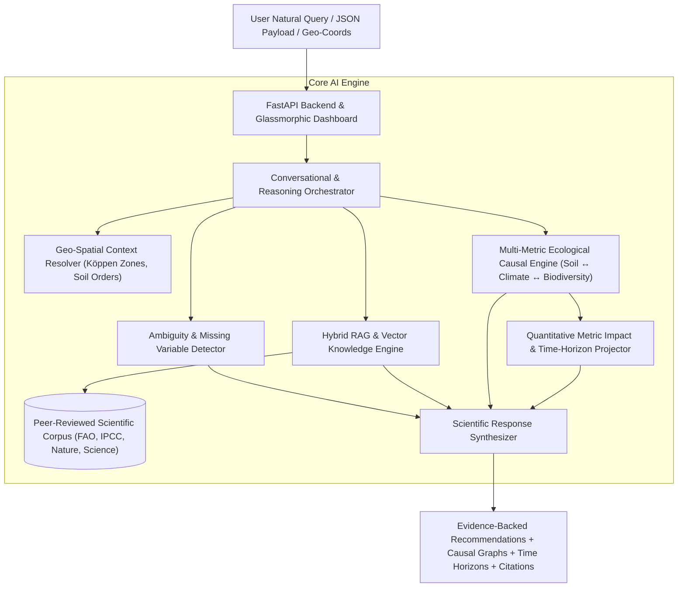

# 🌱 Darukaa.Earth — AI Biodiversity Intelligence & Ecological Reasoning System

[](https://python.org)
[](https://fastapi.tiangolo.com)
[](https://www.fao.org)
[](./test_system.py)

**Darukaa.Earth** is a scientific, knowledge-driven AI environmental intelligence system designed to reason about complex ecological degradation problems. Unlike generic LLM chatbots that produce shallow, single-variable advice, Darukaa.Earth behaves as an **AI Agro-Ecological Scientist**: dynamically coupling soil biophysics, microclimate regimes, land-use disturbance, and multi-trophic biodiversity indicators into evidence-backed, quantifiable restoration plans.

---

## 🏛️ System Architecture



---

## 🌟 Key Capabilities & Evaluation Highlights

### 1. 🧬 Multi-Metric Coupled Reasoning (30% Evaluation Weight)
- Connects at least **3+ simultaneous environmental variables**:
  - $\text{Soil Health (SOC\%, pH, bulk density)} \leftrightarrow \text{Climate (Rainfall, ET deficit, heat)} \leftrightarrow \text{Land-Use (monoculture vs polyculture)} \leftrightarrow \text{Biodiversity (mycorrhizae, pollinators, macrofauna)}$.
- Generates **mechanistic causal chain flowcharts** detailing input states, direct biophysical mechanisms, downstream ecological impacts, and targeted biodiversity indicators.

### 2. 📚 Grounded Knowledge Layer & Hybrid RAG (20% Evaluation Weight)
- Indexed corpus of **16+ peer-reviewed meta-analyses and institutional reports** (FAO, IPCC AR6 WG2, IPBES Global Assessment, *Nature*, *Science*, *Geoderma*, *PNAS*, USDA-NRCS).
- Hybrid vector + TF-IDF cosine similarity search with automatic DOI citation ranking, relevance scores, and biophysical mechanism extraction.

### 3. 💬 Conversational Intelligence & Ambiguity Handling (15% Evaluation Weight)
- **Automatic Missing Parameter Detection**: If given an underspecified prompt like *"Biodiversity is declining on my land"*, the engine detects missing variables (SOC%, pH, rainfall regime, land use history) and generates structured clarifying questions with selectable options.
- **Stateful Multi-Turn Memory**: Retains and enriches context across conversation turns without losing previously established variables.

### 4. 📈 Evidence-Backed Actionable Interventions & Time Horizons (25% Evaluation Weight)
- Every recommendation adheres to the 4-part scientific standard:
  1. **What to do** (e.g. multi-species cover crops, contour agroforestry alley cropping, activated biochar-compost).
  2. **Why it works** (Biophysical mechanisms: hydraulic lift, microbial carbon pump, glomalin secretion, pore architecture).
  3. **Which metrics improve** (Quantified % estimates across 0–1 yr, 2–4 yrs, and 5–10 yrs).
  4. **Primary scientific citations** (FAO 2020, IPCC 2019, Paustian et al. Nature 2016, Lal 2020).

### 5. 🌍 Geo-Spatial Coordinate & Biome Resolution (Bonus Context)
- Resolves Latitude/Longitude coordinates into Köppen-Geiger climate zones, biomes, dominant soil orders, and regional ecological vulnerabilities.

---

## 🚀 Quick Start & Local Execution

### Prerequisites
- Python 3.10+ (Tested on Python 3.14)
- `pip`

### 1. Installation
```bash
# Clone or navigate to the repository directory
cd darukaa

# Install dependencies
pip install -r requirements.txt
```

### 2. Run Automated Test Suite
```bash
python run_tests.py
```
*Executes all 5 unit & integration tests covering RAG retrieval, ambiguity clarification, multi-metric reasoning, geo-spatial resolution, and multi-turn conversational memory.*

### 3. Start the Interactive Web Application
```bash
python main.py
```
Open your browser and navigate to: **`http://127.0.0.1:8000`**

---

## 📡 REST API Reference

| Method | Endpoint | Description |
| :--- | :--- | :--- |
| `POST` | `/api/chat` | Multi-turn conversational endpoint with ambiguity detection and causal reasoning. |
| `POST` | `/api/analyze` | Direct structured JSON analysis returning quantitative metric projections. |
| `GET` | `/api/knowledge/search` | Hybrid vector & keyword search across peer-reviewed ecological literature (`?q=...&top_k=4`). |
| `GET` | `/api/knowledge/all` | Full list of indexed peer-reviewed studies and domain metadata. |
| `GET` | `/api/scenarios` | Pre-configured challenge benchmark scenarios. |
| `POST` | `/api/geo/lookup` | Coordinate and regional climate zone resolver (`{"lat": 23.26, "lon": 77.41}`). |
| `GET` | `/api/health` | Service health status and indexed paper count. |

---

## 📁 Repository Structure

```
darukaa/
├── data/
│   ├── knowledge_corpus.json        # Curated peer-reviewed scientific literature & FAO/IPCC reports
│   ├── eco_regions.json            # Geo-spatial climate & ecoregion data
│   └── scenarios.json              # Standardized benchmark test cases
├── src/
│   ├── __init__.py
│   ├── models.py                   # Pydantic schemas (ChatRequest, EcologicalAnalysisResult, Citations)
│   ├── knowledge_engine.py         # Hybrid Vector + TF-IDF RAG & Citation Retrieval Engine
│   ├── causal_engine.py            # Multi-Metric Ecological Causal Reasoning Engine
│   ├── conversation_engine.py      # Conversational Intelligence, Memory, Clarification Generator
│   └── geo_engine.py               # Spatial / Geo-coordinate Resolver
├── static/
│   ├── index.html                  # Glassmorphic AI Environmental Scientist Dashboard
│   ├── style.css                   # Custom dark-mode theme, animations, responsive grid
│   └── app.js                      # Client app with dynamic causal charts & parameter workbench
├── main.py                         # FastAPI backend service
├── run_tests.py                    # Automated test runner
├── test_system.py                  # Test suite
├── generate_submission_doc.py      # Word (.docx) submission generator
├── Darukaa_AI_Biodiversity_Intelligence_Submission.docx  # Final submission document
├── requirements.txt                # Python package dependencies
└── README.md                       # System documentation
```

---

## 📄 Submission Document (.docx)
The required Word document submission has been compiled at:
**`Darukaa_AI_Biodiversity_Intelligence_Submission.docx`**

Invited Reviewer Accounts (as requested):
- `ankita.dasgupta@darukaa.com`
- `harsh.kumar@darukaa.com`
- `utkarsh.gauniyal@darukaa.com`
- `guneet.mutreja@darukaa.com`
